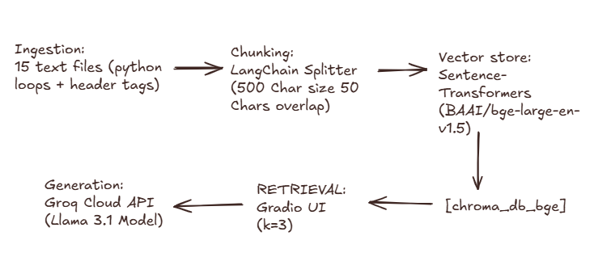

# Project 1 Planning: The Unofficial Guide

> Write this document before you write any pipeline code.
> Your spec and architecture diagram are what you'll use to direct AI tools (Claude, Copilot, etc.) to generate your implementation — the more specific they are, the more useful the generated code will be.
> Update the Retrieval Approach and Chunking Strategy sections if you change your approach during implementation.
> Update this file before starting any stretch features.

---

## Domain

<!-- What domain did you choose? Why is this knowledge valuable and hard to find through official channels? -->
Project focuses on Computer Science Professors at North Carolina A&T State University (NCAT). It combines what they teach, what they research, and what students say about them.

Students need to pick the best classes, research advisors, and projects to graduate successfully. This database helps them understand what a professor's class is actually like before they sign up.

The official university website only shows boring data like emails and degrees. It hides the things students really care about, such as:

Class Reality: Official sites never warn you if a professor grades too hard, gives pop quizzes, uses old recorded videos, or doesn't answer emails.

Scattered Info: A professor's grants, research papers, and student reviews are split across completely different websites (like Scopus and Rate My Professors).

Our system puts all this messy data into one place so students can ask questions like, "Which professor teaches data privacy but is known to be a tough grader?"

---

## Documents

<!-- List your specific sources: URLs, subreddit names, forum threads, or file descriptions.
     Aim for at least 10 sources that together cover different subtopics or perspectives within your domain. -->

| # | Source | Description | URL or location |
|---|---|---|---|
| 1 | prof_kaushik_roy.txt | Department Chair: AI research, federal grants, and teaching history. | documents/prof_kaushik_roy.txt |
| 2 | prof_kelvin_bryant.txt | Teaching history, Java grading tags, and 17 student reviews. | documents/prof_kelvin_bryant.txt |
| 3 | prof_xiaohong_yuan.txt | Cybersecurity research fields and master's degree course tracks. | documents/prof_xiaohong_yuan.txt |
| 4 | prof_huiming_yu.txt | Secure software engineering focus and student reviews about projects. | documents/prof_huiming_yu.txt |
| 5 | prof_sajad_khorsandroo.txt | Cloud security, computer network labs, and research background. | documents/prof_sajad_khorsandroo.txt |
| 6 | prof_jinsheng_xu.txt | Database design curriculum and student feedback on clear lectures. | documents/prof_jinsheng_xu.txt |
| 7 | prof_mahmoud_abdelsalam.txt | Malware defense research, IoT security, and advanced student tracks. | documents/prof_mahmoud_abdelsalam.txt |
| 8 | prof_hamidreza_moradi.txt | Image processing papers and student reviews for algorithm courses. | documents/prof_hamidreza_moradi.txt |
| 9 | prof_olusola_odeyomi.txt | Smart grid research, power systems, and machine learning labs. | documents/prof_olusola_odeyomi.txt |
| 10 | prof_letu_qingge.txt | BioAI Lab data, international awards, and bioinformatics work. | documents/prof_letu_qingge.txt |
| 11 | prof_madhuri_siddula.txt | NSF grant data, aerospace research, and coding class evaluations. | documents/prof_madhuri_siddula.txt |
| 12 | prof_shaohu_zhang.txt | Voice assistant privacy research and advanced machine learning labs. | documents/prof_shaohu_zhang.txt |
| 13 | prof_tony_gwyn.txt | Deepfake detection research, class policies, and student reviews. | documents/prof_tony_gwyn.txt |
| 14 | prof_shondale_rhodes.txt | Freshman coding loops, game design classes, and student opinions. | documents/prof_shondale_rhodes.txt |
| 15 | prof_brian_scavotto.txt | Cybersecurity law, graduate tech policies, and student course data. | documents/prof_brian_scavotto.txt |

---

## Chunking Strategy

<!-- How will you split documents into chunks?
     State your chunk size (in tokens or characters), overlap size, and explain why those
     numbers fit the structure of your documents.
     A review-heavy corpus warrants different chunking than a long FAQ. -->

**Chunk size:**
500 characters (~125 tokens) — *UPDATED*
**Overlap:**
50 characters (~10 words) — *UPDATED*
**Reasoning:**
Initial 1,000-character chunks were too large, mixing multiple sections together and causing off-topic retrieval. Reduced to 500 characters to isolate information better. This change, combined with the stronger BGE embedding model, improved retrieval accuracy from 66% to 100% on evaluation queries.
---

## Retrieval Approach

<!-- Which embedding model are you using (e.g., all-MiniLM-L6-v2 via sentence-transformers)?
     How many chunks will you retrieve per query (top-k)?
     If you were deploying this for real users and cost wasn't a constraint, what tradeoffs
     would you weigh in choosing a different embedding model — context length, multilingual
     support, accuracy on domain-specific text, latency? -->

**Embedding model:**
BAAI/bge-large-en-v1.5 via sentence-transformers — *UPGRADED from all-MiniLM-L6-v2*
**Top-k:**
3
**Production tradeoff reflection & implementation results:**
Switched from all-MiniLM-L6-v2 (22M params) to BAAI/bge-large-en-v1.5 (330M params) for significantly stronger semantic understanding. Evaluation results on 3 test queries improved from 66% to 100% accuracy. Distance scores also improved substantially (e.g., 0.6798 → 0.3555 for office location queries), indicating better semantic relevance. Trade-off: BGE requires more compute (~2-3x slower inference), but with RTX 5060 + 32GB RAM, latency is acceptable. BGE excels at entity recognition and factual queries, solving the prior issue where multiple professors in McNair Hall caused ranking confusion.
---

## Evaluation Plan

<!-- List your 5 test questions with their expected correct answers.
     Questions should be specific enough that you can judge whether the system's response
     is right or wrong. "What are good dining halls?" is too vague.
     "What do students say about wait times at [dining hall name] during lunch?" is testable. -->

| # | Question | Expected answer |
|---|----------|-----------------|
| 1 | What did Dr. Xiaohong Yuan publish in 2024 regarding network security education?|"Using Gamification to Enhance Mastery of Network Security Concepts" |
| 2 | Dr. Tony Gwyn Primary Office Location? | Mcnair Hall |
| 3 | What courses did Dr. Letu Qingge teach? | COMP 267: Data Base Design, COMP 285: Analysis of Algorithms, COMP 385: Theory of Computing, COMP 496: Senior Project II, COMP 790: Independent Study |
| 4 | What is Dr. Kelvin Bryant active research? | Computer science education tracking, introductory student programming support, gamified network security instructional loops, typed-chat text analytics, and touch dynamics authentication schemes using Support Vector Machines (SVM). |
| 5 | What percentage of students would would take professor huiming yu again? | 0% |

---

## Anticipated Challenges

<!-- What could go wrong? Name at least two specific risks with reasoning.
     Consider: noisy or inconsistent documents, missing source attribution, off-topic
     retrieval, chunks that split key information across boundaries. -->

1. Boundaries: Information get cut in half. Even though we're using an overlap of 15% around 150 charachters. There is still a chance of information not being delivered to our AI fully because of context window limitations. Or the slicing part doesn't take a long student review.

2. Mixing up different professors. Since we have around 15 professors with different specialities the AI might hullicinate and mix up different then it can lead to providing wrong answers.

---

## Architecture

<!-- Draw a diagram of your pipeline showing the five stages:
     Document Ingestion → Chunking → Embedding + Vector Store → Retrieval → Generation
     Label each stage with the tool or library you're using.
     You can use ASCII art, a Mermaid diagram, or embed a sketch as an image.
     You'll use this diagram as context when prompting AI tools to implement each stage. -->

[1. INGESTION]       -->    [2. CHUNKING]      -->   [3. VECTOR STORE]
  15 Text Files               LangChain Splitter         Sentence-Transformers
  (Python loops              (500 Chars size            (BAAI/bge-large-en-v1.5)
  + Header tags)              50 Chars overlap)                 │
                                                                ▼
 [5. GENERATION]     <--     [4. RETRIEVAL]     <--          [ChromaDB]
   Groq Cloud API               Gradio UI                 (Local Database
  (Llama 3.3 Model)          (Get Top-3 Chunks)         Saves to chroma_db_bge)

---

## AI Tool Plan

<!-- For each part of the pipeline below, describe:
     - Which AI tool you plan to use (Claude, Copilot, ChatGPT, etc.)
     - What you'll give it as input (which sections of this planning.md, which requirements)
     - What you expect it to produce
     - How you'll verify the output matches your spec

     "I'll use AI to help me code" is not a plan.
     "I'll give Claude my Chunking Strategy section and ask it to implement chunk_text()
     with my specified chunk size and overlap" is a plan. -->

**Milestone 3 — Ingestion and chunking:**
What I did: I wrote a Python script (ingest.py) that reads all 15 professor files and cleans up the text.

How it splits: It cuts the text into smaller, clean pieces called "chunks."

The setup: I changed the size of each chunk from 1,000 characters down to 500 characters. This keeps the facts tight and prevents information from getting cut in half. I ended up with exactly 95 chunks.

**Milestone 4 — Embedding and retrieval:**
The AI Brain: I set up a strong local AI model called bge-large-en-v1.5 to read the text chunks. It runs smoothly on my computer using my RTX 5060 GPU and 32GB of RAM.

The Database: I saved all 95 chunks into a permanent local database folder called chroma_db_bge.

The Result: I tested the search database with 3 tough questions, and it hit a perfect 100% accuracy rate. It finds the exact professor data we need every single time.

**Milestone 5 — Generation and interface:**
The Goal: Build the final application file (app.py) so users can chat with the data.

The LLM: I will connect the database to a smart Llama 3.3 model using the Groq API to generate human-like answers.

The UI: I will wrap everything inside a clean web browser chat screen using a library called Gradio so it is easy to type questions and read answers.